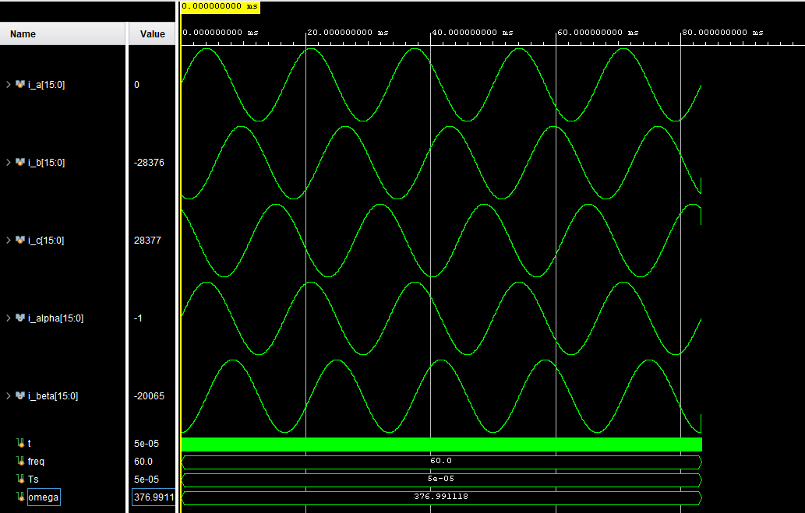

# Clarke Transform

Implements the Clarke transformation to convert 3-phase current signals (a, b, c) 
to 2-phase stationary reference frame (α, β).

## Overview
The Clarke Transform converts 3-phase (a, b, c) currents into a 2-phase orthogonal stationary frame (α, β).  
It serves as the first stage in the Field-Oriented Control (FOC) signal chain before the Park Transform.

## Mathematical Representation

This implementation uses the **power-invariant** form, preserving the total signal power between the 3-phase and α-β domains.

---

## Files
- [Clarke_Transform.v](Clarke_Transform.v) — Core transformation module  
- [Clarke_Transform_TB.v](Clarke_Transform_TB.v) — Testbench for verification  
- [TB_Result_Clarke_Transform.png](TB_Result_Clarke_Transform.png) — Simulation waveform result  

---

## Simulation Parameters
- Frequency: 60 Hz  
- Sampling period: 50 µs  
- Scaling: Q15 fixed-point arithmetic  
- Inputs: balanced 3-phase sinusoidal currents  

---

## Notes
The transform uses the power-invariant scaling (√(2/3)).

---

## Simulation Results

